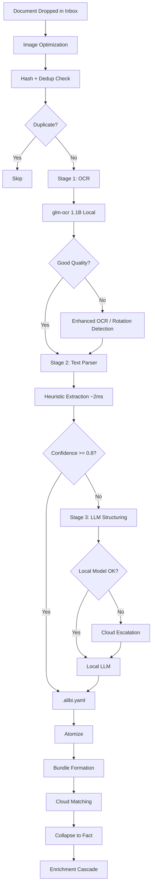
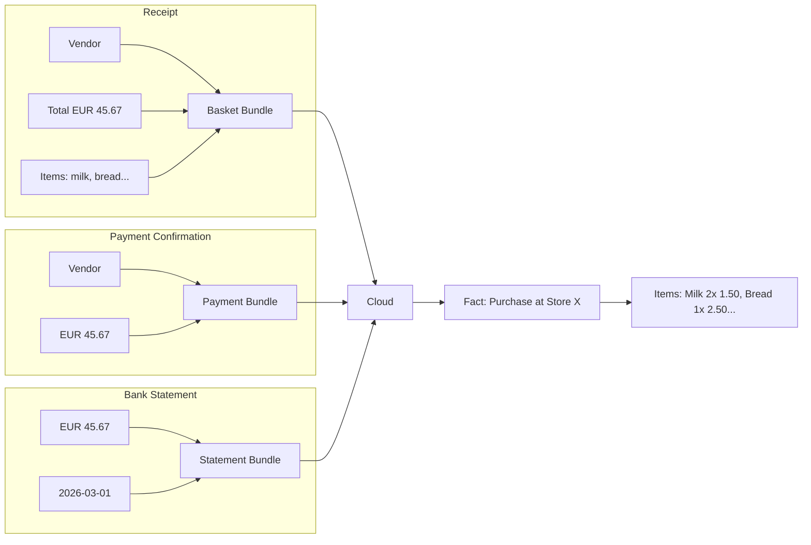
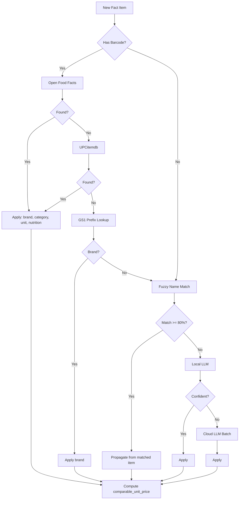

# Architecture

## Why Alibi Exists

Most expense trackers stop at "you spent X EUR at Store Y on Date Z." That's the equivalent of knowing your fuel bill without knowing your car's mileage.

Alibi goes deeper: it captures **item-level data** with units, quantities, brands, categories, and barcodes -- enabling questions no other open-source tool can answer:

- "How much do I pay per liter of milk across different stores?"
- "Which store gives the best price per kilogram for chicken?"
- "Am I spending more on dairy than last quarter?"
- "What's my average basket size at each vendor?"
- "How much do I pay per egg at Store A vs Store B?" (6-pack vs 12-pack, normalized to price per piece)

Because items are identified down to barcode and brand level, the structured data becomes a foundation for **further enrichment on demand**: an LLM with access to alibi records can calculate nutritional intake "by fridge" -- not the traditional "by dish" calorie tracking, but a practical shortcut: scan your supermarket receipts, and the system knows you bought 2L of 3% milk (120 kcal/L) and 500g of chicken breast (165 kcal/100g). Not as precise as dish-level tracking, but far easier -- a "reverse calculator" for users who want nutritional insights without logging every meal.

**The schema creates the capability.** Fields like `unit`, `unit_quantity`, `comparable_unit_price`, `comparable_name`, and `product_variant` make cross-vendor, cross-language, and cross-currency comparison possible. Every algorithm and enrichment pipeline exists to fill these fields as completely as possible -- because an empty field is a missed insight.

## Design Principles

1. **Local-first with cloud escalation.** All extraction starts with local LLMs (no API keys required). When local models can't handle a document, the system escalates to cloud APIs -- and learns from each interaction to reduce future cloud dependency.

2. **Cross-document validation.** A single receipt is self-reported data. When a receipt, a payment confirmation, and a bank statement all agree on the same transaction, that's a verified fact. The Atom-Cloud-Fact model makes this verification automatic.

3. **Progressive enrichment.** Items start with just a name from the receipt. Over time, they accumulate brand, category, barcode, and unit data -- from multiple sources, each with tracked provenance and confidence. This structured foundation enables on-demand enrichment with nutritional data, allergen info, or any other product attribute available through external APIs or LLM inference.

4. **Human-editable pipeline.** Every extraction produces a `.alibi.yaml` file that users can inspect and correct. Corrections feed back into the system, improving future extractions for the same vendor.

---

## System Overview

```
                Interfaces                    Service Layer           Core
                ---------                     -------------           ----
            +-- CLI (Click)    --+
            +-- FastAPI          -+
            +-- MCP Tools        -+--->  Service Layer  --->  Pipeline Stages
            +-- Telegram Bot     -+      (async boundary)    (sync internals)
            +-- File Watcher   --+            |
                                              v
                                         Event Bus
                                              |
                               +--------------+--------------+
                               v              v              v
                         Obsidian Notes   Webhooks      Analytics Export
```

All 5 interfaces route through the same service layer. The CLI and API are thin clients -- all business logic lives in `alibi/services/`.

## Document-Agnostic Approach

Alibi works regardless of what documents you provide. Each document type adds a different dimension of data:

| What You Provide | What Alibi Records |
|-----------------|-------------------|
| **POS/card slip only** (no item list) | Vendor, amount, date, payment method |
| **Receipt with items** | All above + individual items with quantities, prices, barcodes |
| **Bank statement line** | Vendor, amount, date (from bank's perspective) |
| **Invoice** | Vendor, line items, tax breakdown, payment terms |
| **Payment confirmation** | Amount, date, payment method confirmation |

When multiple documents describe the same purchase, they don't just duplicate -- they **validate each other** and form a richer picture. A receipt provides item details the bank statement doesn't have. A payment confirmation proves the transaction actually went through. Each document type is another dimension of the same event, and Alibi collapses them into a single verified fact.

The system never requires a specific document type. One receipt is enough. Five documents for the same purchase are better -- not for trust (this is a personal tool), but for completeness of data and analysis depth.

---

## Document Processing Pipeline



### Stage 1: OCR
Local vision model (glm-ocr, 1.1B parameters) extracts raw text from images. Layout-aware, runs in 1.5-6 seconds. Four-tier fallback: normal -> enhanced -> rotation detection -> fallback model. Non-Latin scripts (Greek, Russian) route to MiniCPM-V automatically.

### Stage 2: Text Parser
Heuristic parser extracts structured data from OCR text in ~2ms. Handles vendor names, amounts, dates, item lines (multiple columnar formats), payment methods, VAT, barcodes. Returns a confidence score and per-field confidence map.

### Stage 3: LLM Structuring (conditional)
Only invoked when the text parser's confidence is below threshold. Two modes:
- **Correction prompt** (confidence >= 0.3): Sends only uncertain text regions with confidence hints. ~60% token reduction.
- **Full prompt** (confidence < 0.3): Sends complete OCR text for full extraction.

Local-first (qwen3:8b via Ollama), with cloud fallback (Gemini Flash) when the local model can't handle the document. Each cloud call is tracked -- the system learns vendor templates to avoid future escalation.

### YAML Intermediary
Processing is split into two phases:
- **Phase A** (extraction -> YAML): produces `.alibi.yaml` as the authoritative intermediate
- **Phase B** (YAML -> DB): reads the YAML and persists atoms/bundles/clouds/facts

This enables a correction workflow: edit the YAML, re-process to update the database. The file watcher auto-detects YAML modifications.

---

## Atom-Cloud-Fact Data Model



| Concept | What It Is | Example |
|---------|-----------|---------|
| **Atom** | A single observation from a document | "vendor: Alphamega", "total: EUR 45.67" |
| **Bundle** | Atoms grouped into a structural unit | All atoms from one receipt |
| **Cloud** | Probabilistic cluster of related bundles | Receipt + payment + statement for same transaction |
| **Fact** | Confirmed real-world event | "Spent EUR 45.67 at Alphamega on 2026-03-01" |

**Cloud formation rules:**
- Vendor gate: bundles must match on vendor identity
- Date tolerance: receipt<->payment = 1 day, invoice<->payment = 60 days
- Amount matching with tolerance
- Learning: weights adjust from correction history

---

## Enrichment Cascade



| Tier | Source | Confidence | Data Provided |
|------|--------|-----------|---------------|
| 1 | Historical lookup | 0.95 | unit_quantity from same vendor+product |
| 2 | Open Food Facts | 0.95 | brand, category, nutrition via barcode |
| 3 | UPCitemdb | 0.90 | brand, category via barcode |
| 4 | GS1 prefix | 0.80 | brand from barcode company prefix |
| 5 | Fuzzy name match | varies | brand, category from product index |
| 6 | Local LLM | 0.70 | brand, category inference |
| 7 | Gemini mega-batch | 0.85 | brand, category, unit_quantity |
| 8 | Anthropic cloud | 0.85 | brand, category refinement |

Each source records its provenance (`enrichment_source`) and confidence (`enrichment_confidence`). Higher-confidence sources override lower ones.

### Product Variant vs. Product Attributes

Item differentiation uses a **two-tier model**:

**Primary variant** (`product_variant` column on `fact_items`): A single value that most affects price comparison. This is the distinguishing factor you'd use when comparing "is Store A or Store B cheaper for milk?"

| Category | Example Variants | What it means |
|----------|-----------------|---------------|
| Dairy | `3%`, `5%`, `15%`, `light`, `strained`, `unsalted` | Fat content or preparation |
| Eggs | `L`, `M`, `S`, `XL` | Size grade |
| Fruit/Snacks | `20/30`, `30/40` | Dried fruit caliber |
| Canned Food | `light` | Low-sodium/sugar version |

**Secondary attributes** (annotations with `annotation_type="product_attribute"`): Labels that affect purchasing decisions but don't directly determine unit price:

| Attribute | Meaning |
|-----------|---------|
| `organic` | Certified organic/bio |
| `free-range` | Free-range farming |
| `lactose-free` | Lactose-free variant |
| `wholegrain` | Wholegrain product |
| `gluten-free` | Gluten-free certified |
| `sugar-free` | No added sugar |

**Extraction sources**: Primary variants come from item names (heuristic) or OFF fat data. Secondary attributes come from OFF labels and item name keywords. Both are extracted during the enrichment cascade.

**Filtering**: `WHERE product_variant = '3%'` for price comparison. `JOIN annotations ON ... WHERE key = 'organic'` for attribute filtering.

**Note on OFF coverage**: Open Food Facts has limited coverage for Cyprus local products (barcodes starting with `529x`). Most enrichment for local items relies on name-based heuristics rather than OFF data.

### Price Factor Analysis

The two-tier variant/attribute model enables **factor-agnostic price analysis**. Rather than hardcoding which attributes affect price, the system discovers this from data:

```python
from alibi.services.analytics import analyze_price_factors

# Which attributes affect milk prices?
profiles = analyze_price_factors(db, comparable_name="Milk")
# -> PriceFactor(attribute="variant:5%", avg_premium=+0.35, pct_premium=+23%, confidence=0.85)
# -> PriceFactor(attribute="organic", avg_premium=+0.80, pct_premium=+53%, confidence=0.72)

# Category-wide analysis
factors = get_category_price_factors(db, category="Dairy")
# -> {"variant:light": PriceFactor(...), "organic": PriceFactor(...), ...}

# High-level summary across all categories
summary = price_factor_summary(db)
# -> {"Dairy": [...], "Eggs": [...], ...}
```

**How it works:**
1. Groups `fact_items` by `comparable_name` (normalized English name)
2. Collects attributes from three sources: `product_variant`, `brand`, and annotations (`product_attribute` type)
3. For each attribute, computes the **marginal price impact**: average `comparable_unit_price` with that attribute minus the baseline (items without it)
4. Confidence scales with observation count: `min(observations / 10, 1.0)`

This means all attributes -- variant, brand, organic, free-range -- compete equally. The system discovers that "free-range" eggs cost 30% more, or that brand X milk is cheaper than brand Y, without any hardcoded assumptions about which factors matter.

**Key types:**
- `PriceFactor`: attribute name, absolute premium, percentage premium, observation counts, confidence
- `ProductPriceProfile`: per-product summary with baseline price, discovered factors, price range, vendor list

**Service layer functions** (in `alibi.services.analytics`):
- `analyze_price_factors(db, comparable_name?, category?, min_observations=3)` -- per-product profiles
- `get_category_price_factors(db, category, min_observations=3)` -- aggregated factors for a category
- `price_factor_summary(db, min_observations=3)` -- all categories at a glance

---

## Unit Normalization and Comparison

The key to cross-vendor comparison. When receipts across stores list the same product differently:

```
Store A: "MILK 1L"    -> unit=l, unit_quantity=1.0, price=1.50
  comparable_unit_price = 1.50 EUR/L

Store B: "FRESH MILK"  -> unit=l, unit_quantity=1.5, price=2.10  (volume from barcode lookup)
  comparable_unit_price = 1.40 EUR/L

Store C: "GALAKTOS 1L" -> comparable_name="Milk", unit=l, unit_quantity=1.0, price=1.35
  comparable_unit_price = 1.35 EUR/L  (Greek receipt, English comparable_name)
```

**Result**: Store C is cheapest at EUR 1.35/L. Cross-language comparison works because `comparable_name` translates all item names to English.

**Unit/unit_quantity sources** (priority order):
1. **Receipt text**: Parser extracts from item name ("500g", "1L", "0.339kg")
2. **Barcode lookup**: Open Food Facts product "quantity" field
3. **Historical data**: Previous purchases of the same product at the same vendor
4. **Name match propagation**: From similar enriched items

---

## Adaptive Learning

The system learns from every correction to reduce future manual intervention:

- **Vendor templates**: After processing documents from a vendor, the system builds extraction templates (expected fields, formats, OCR tier needed). Future documents from the same vendor use the template, reducing LLM calls.
- **Cloud formation weights**: When a user corrects a false cloud match, the system records the feature vector. Future matching uses adjusted thresholds.
- **Product knowledge**: Each confirmed enrichment becomes a reference for fuzzy matching. The product database grows with every processed document.

---

## Integration Points

| Interface | Use Case |
|-----------|----------|
| **CLI** (`lt`) | Local operation, scripting, cron jobs |
| **REST API** | Web dashboards, mobile apps, automation |
| **MCP Server** | AI assistant integration (Claude, etc.) |
| **Telegram Bot** | Mobile document capture, quick queries |
| **File Watcher** | Drop-folder automation (inbox monitoring) |

### OpenClaw Integration

[OpenClaw](https://github.com/openclaw/openclaw) can serve as a document capture and query frontend for Alibi through its native MCP support:

- **Document capture**: Send receipt photos to OpenClaw, which forwards them to Alibi's MCP server or REST API for processing
- **Natural language queries**: "How much did I spend on groceries last month?" routes through OpenClaw to Alibi's analytics
- **Enrichment triggers**: Conversational commands to trigger barcode lookups or corrections
- **Custom workflows**: Chain Alibi's API with other services (accounting, budgeting, nutrition tracking)

This extends Alibi's reach without requiring changes to the core system.

---

## Document Type Routing

Four-layer detection with early exit:

1. **Folder routing**: typed subfolder (receipts/, invoices/) skips all detection
2. **Post-OCR text classification**: keyword-based after Stage 1
3. **LLM extraction**: document_type field from Stage 3
4. **Heuristic reclassification**: pattern matching on extracted fields

| Interface | How Type Is Specified |
|-----------|---------------------|
| Filesystem | Place file in `receipts/`, `invoices/`, etc. |
| API | `POST /api/v1/process?type=receipt` |
| MCP | `ingest_document(path, doc_type="receipt")` |
| Telegram | `/receipt` command |
| CLI | `lt process -p file.jpg --type receipt` |

---

## Vendor Identity System

Vendors are matched through a multi-signal identity system:

1. **VAT number** (strongest): exact match = 1.0, fuzzy >= 0.85 = 0.9
2. **Tax ID**: secondary identifier
3. **Name matching**: fuzzy matching with normalization as fallback
4. **Identity merging**: `merge_vendors()` atomically transfers all members

Country code normalization strips prefixes for cross-format matching.

---

## Database

SQLite with WAL mode for concurrent reads. Schema documented in [SCHEMA.md](SCHEMA.md). Key table groups:

- **Pipeline**: documents -> atoms -> bundles -> clouds -> facts -> fact_items
- **Identity**: identities + identity_members (vendor entity resolution)
- **Enrichment**: product_cache (barcode lookups), product_name_fts (fuzzy search)
- **Learning**: correction_events, cloud_correction_history
- **Supporting**: users, api_keys, annotations, budgets, budget_entries, items
- **Privacy**: masking_snapshots (tier-based disclosure tracking)

## Privacy & Data Control

Three independent systems for privacy-preserving data handling:

1. **Tiered masking** (`alibi/masking/`): 5-tier disclosure (T0=hidden through T4=exact). Each tier controls amount precision, vendor visibility, date granularity, line item inclusion, and provenance access. API: `GET /api/v1/export/masked/transactions?tier=N`, CLI: `lt export masked`.

2. **Anonymization export** (`alibi/anonymization/`): Three levels -- categories_only (lossy, safe for external use), pseudonymized (consistent fake names, shifted amounts/dates, reversible with local key), statistical (aggregates only). API: `POST /api/v1/export/anonymized?level=X`, CLI: `lt export anonymized`.

3. **Cloud AI masking** (`alibi/masking/service.py:mask_for_cloud_ai`): Replaces sensitive entities (vendors, names, card numbers) with placeholders and rounds amounts to ranges before sending to cloud APIs. Reversible via stored masking map.

## Budget System

Scenario-based budgeting with actual-vs-target variance tracking (`alibi/budgets/`):

- **Scenarios**: actual, projected, target data types with parent branching
- **Entries**: category + amount + period (YYYY-MM) per scenario
- **Actual spending**: auto-populated from fact_items grouped by category
- **Comparison**: per-category variance between any two scenarios
- Accessible via CLI (`lt budget`), API (`/api/v1/budgets/`), Telegram (`/budget`), and MCP

## Vector Search

Optional LanceDB-powered semantic search (`alibi/vectordb/`):

- **Embeddings**: Ollama `nomic-embed-text` (768 dimensions)
- **Index types**: transactions, artifacts, items
- **Search modes**: SQL LIKE, vector similarity, unified (combined with deduplication)
- CLI: `lt vectordb init/status/search`, API: `GET /api/v1/search?semantic=true`
- Config: `ALIBI_LANCE_PATH` sets storage directory

## Authentication

- **API keys**: BIP39 mnemonic phrases (6 words), hashed with PBKDF2 + per-key salt
- **User model**: users with contacts (email, telegram_user_id), document provenance tracking
- **Rate limiting**: per-IP in-memory rate limiter on API endpoints
- **Security headers**: CSP, X-Frame-Options, X-Content-Type-Options, Referrer-Policy

## Event Bus

Synchronous in-process event system:

- `DOCUMENT_INGESTED` -> Obsidian note generation
- `FACT_CREATED` / `FACT_UPDATED` -> analytics export, enrichment trigger
- `FACT_DELETED` -> cleanup
- `CORRECTION_APPLIED` -> learning propagation

Subscribers: Obsidian notes, webhook dispatcher, analytics export, auto-enrichment.

## MindsDB Predictions

Optional ML layer powered by a self-hosted [MindsDB](https://mindsdb.com/) instance. No cloud dependency -- MindsDB runs locally alongside Ollama.

### Models

**Spending Forecast** (`alibi_spending_forecast`): time-series predictor trained on monthly spending aggregated by category. Uses Lightwood's time-series engine with configurable lookback window (default: 6 months) and forecast horizon (default: 3 months). Training data is built from fact items grouped by `(year_month, category)` with zero-fill for months without purchases in a given category.

**Category Classifier** (`alibi_category_classifier`): supervised classifier that predicts item categories from `(vendor_name, item_name, amount)` input features. Learns from your existing categorized items. Categories with fewer than 5 training examples are excluded, and a minimum of 50 total items is required to train.

### Architecture

```
alibi/predictions/
  client.py    -- MindsDB HTTP REST client (no SDK dependency)
  spending.py  -- Forecast predictor (data prep, train, query)
  category.py  -- Category predictor (data prep, train, classify)

alibi/services/predictions.py  -- Service facade (8 functions)
alibi/api/routers/predictions.py  -- 8 REST endpoints
alibi/commands/analytics.py  -- CLI: `lt predictions` command group
```

The MindsDB client communicates via the REST API (port 47334) using plain HTTP -- no MindsDB Python SDK is required. Training data is uploaded as DataFrames to MindsDB's `files` database, and predictions use SQL JOINs against the trained models.

### Data Flow

1. **Train**: service queries alibi SQLite -> aggregates data -> uploads CSV to MindsDB -> creates model -> polls until training completes (5s intervals, 600s timeout)
2. **Predict**: service sends SQL query to MindsDB -> model returns predictions with confidence scores
3. **Apply**: for category predictions, `--apply` flag writes results back to alibi's `fact_items` table via the correction service

### Configuration

```bash
ALIBI_MINDSDB_ENABLED=true                    # Enable predictions
ALIBI_MINDSDB_URL=http://127.0.0.1:47334      # MindsDB REST API
```

Requires MindsDB with the Lightwood ML engine: `docker run -p 47334:47334 mindsdb/mindsdb:lightwood`
