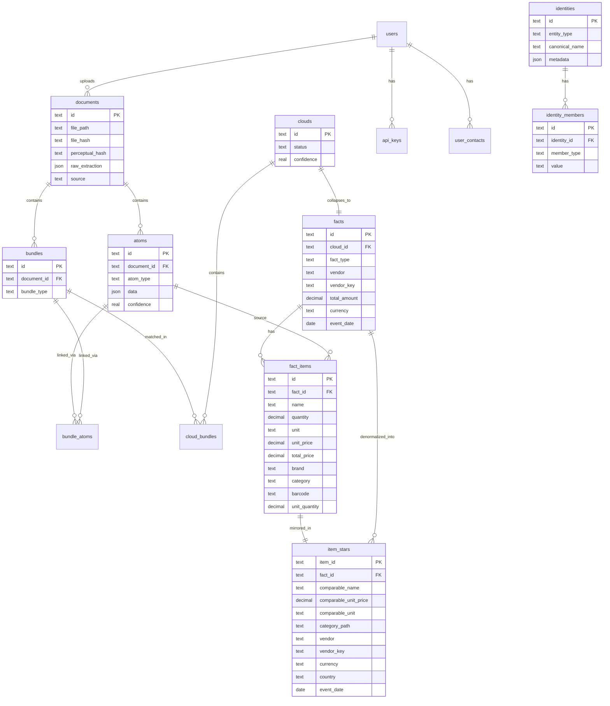

# Database Schema

Alibi uses SQLite with the Atom-Cloud-Fact data model for cross-document transaction validation.

## Entity Relationship Diagram

## Core Pipeline Tables

### documents
Source files (receipts, invoices, statements). Each file is hashed (SHA-256 + perceptual hash for images) to prevent duplicate ingestion.

### atoms
Individual extracted observations from a document. Each atom has a type and a JSON data payload:

| atom_type | data fields |
|-----------|------------|
| `vendor` | name, vat_number, tax_id, address |
| `amount` | value, currency, semantic_type (total/subtotal/tax/discount) |
| `item` | name, quantity, unit, unit_price, total_price, barcode |
| `payment` | method, card_last4, amount, currency |
| `datetime` | date, time, timezone |
| `tax` | rate, amount, type |

### bundles
Structural groupings of atoms from one document. A receipt produces a `basket` bundle; a bank statement line produces a `statement_line` bundle.

| bundle_type | Description |
|-------------|-------------|
| `basket` | Receipt items + total + vendor |
| `payment_record` | Payment confirmation or card slip |
| `invoice` | Invoice with line items |
| `statement_line` | Bank/card statement entry |

### clouds
Probabilistic clusters that match bundles across documents. A receipt bundle and a payment confirmation bundle for the same transaction form a cloud.

| status | Meaning |
|--------|---------|
| `forming` | Bundles matched but not yet confirmed |
| `collapsed` | Validated and converted to a fact |
| `disputed` | User flagged as incorrect match |

Match types: `exact_amount`, `near_amount`, `sum_of_parts`, `vendor+date`, `item_overlap`, `manual`.

### facts
Confirmed transactions derived from collapsed clouds. The single source of truth for analytics.

| fact_type | Description |
|-----------|-------------|
| `purchase` | Standard purchase transaction |
| `refund` | Return/refund transaction |
| `subscription_payment` | Recurring payment |

### fact_items
Denormalized line items for fast queries and analytics. Key fields for deep analysis:

| Field | Purpose |
|-------|---------|
| `name` | Original item name from document |
| `name_normalized` | Lowercased, trimmed name |
| `comparable_name` | English-translated, brand/size-stripped name for cross-language comparison |
| `comparable_unit` | Normalized comparison unit (l, kg, pcs) — the group-by axis for all item analytics |
| `unit` | Measurement unit (pcs, kg, l, ml, g, oz, lb) |
| `unit_quantity` | Package size (e.g., 1.0 for 1L milk) |
| `comparable_unit_price` | Normalized price (EUR/L, EUR/kg, EUR/pcs) for comparison |
| `product_variant` | Single salient variant distinguishing item types within a product (e.g., "3%" milk fat, "L" egg size) |
| `category` | Product category (from enrichment) |
| `category_path` | Hierarchical category path from the controlled taxonomy (e.g., `food/dairy/milk`) |
| `attributes` | JSON map of controlled product facets, filterable/groupable independently (`size`, `fat_pct`, `organic`, `free_range`, `lactose_free`, and `state` — fresh/frozen/canned/dried/cured/pickled/roasted/cooked) |
| `brand` | Product brand (from enrichment) |
| `barcode` | EAN/UPC barcode |
| `enrichment_source` | How brand/category was determined |
| `enrichment_confidence` | Confidence score (0.0-1.0) |
| `unit_enriched` / `comparable_name_enriched` / `state_enriched` | Idempotency sentinels (0/1): mark a row the enrichment pass has processed — including an answered "no value" — so unsolvable rows are not re-sent to the LLM every run |
| `category_taxonomy_version` | Taxonomy version a row was categorized under; a `TAXONOMY_VERSION` bump re-selects it |

### item_stars
Materialised analytics mirror (migration 039) — one row per `fact_item`, denormalising the item's analytic axes together with its parent fact's `vendor` / `vendor_key` / `currency` / `country` / `event_date` / `event_time`. The "item as star" surface (average comparable unit price by product across vendors/countries/periods, price trends, basket composition) reads this table so those aggregations need no per-call joins.

It is a derived mirror — `fact_items` + `facts` stay canonical. Both foreign keys use `ON DELETE CASCADE`, so removing a fact or item auto-prunes its stars. Kept in sync by:

- the collapse/store path (`v2_store.store_fact` refreshes a fact's stars in the same transaction);
- the per-fact / per-document enrichment hooks (after enrichment writes `comparable_name` / `category_path` / brand / category directly to `fact_items`);
- `lt items rebuild` (service `rebuild_item_stars`) — the full-rebuild drift safety net; run it after batch enrichment passes (`lt enrich categorize`, `lt enrich states`, comparable-price backfills, comparable_name merges) that bypass the incremental hooks.

The mirror also carries `product_variant` and the `attributes` JSON (including the `state` facet), so item analytics can filter/group by any facet (e.g. `--attr state=canned`) without joining back to `fact_items`.

Surfaces: `lt items {rebuild,avg-price,trend,basket}` (CLI), `/api/v1/item-stars{,/avg-price,/trend,/basket,/rebuild}` (API), and the "Item Sky" web view.

## Identity Tables

### identities
User-defined canonical entities for vendor deduplication. A single identity groups multiple vendor names, VAT numbers, and other identifiers.

Entity types: `vendor`, `item`, `pos_provider`.

### identity_members
Values that belong to an identity. Member types: `name`, `normalized_name`, `vat_number`, `tax_id`, `vendor_key`, `barcode`.

## Supporting Tables

| Table | Purpose |
|-------|---------|
| `users` | User accounts (id, name, is_active) |
| `user_contacts` | Contact methods (telegram, email) |
| `api_keys` | PBKDF2-hashed API keys with salt |
| `items` | Physical asset tracking (warranties, insurance) |
| `annotations` | Open-ended key-value metadata on any entity |
| `budgets` / `budget_entries` | Budget scenarios and per-category amounts |
| `product_cache` | Cached barcode lookups (Open Food Facts, UPCitemdb) |
| `product_name_fts` | FTS5 index for fuzzy product matching |
| `item_stars` | Materialised item-analytics mirror (see above) |
| `correction_events` | Audit log of field corrections (adaptive learning) |
| `cloud_correction_history` | Cloud match correction data (formation learning) |
| `masking_snapshots` | Data anonymization snapshots |

## Schema Management

The database schema is **generated** into `alibi/db/schema.sql` from the migration chain — it is a build artifact, not hand-maintained. Migrations live in `alibi/db/migrations/` (002–044) with UP and DOWN blocks for reversibility, and the `schema_version` table tracks applied versions (current head: **44**). A consistency test asserts the committed `schema.sql` matches a fresh generation, so the two can never drift.

To add a schema change: write a new migration, then regenerate the snapshot with `uv run python scripts/generate_schema.py` (never hand-edit `schema.sql`). Existing databases auto-migrate to head on the next `lt` command (backup-first). See the [Contributing Guide](../CONTRIBUTING.md#adding-a-migration).
