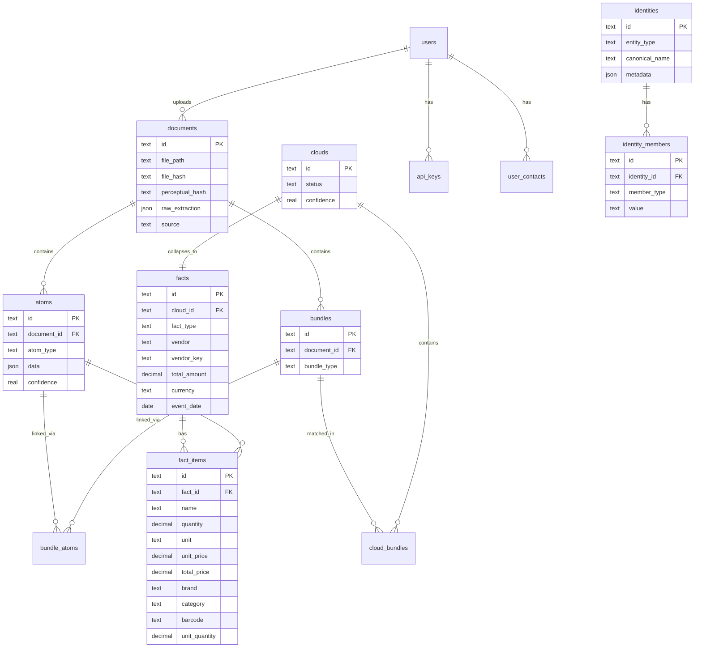

# Database Schema

Alibi uses SQLite with the Atom-Cloud-Fact data model for cross-document transaction validation.

## Entity Relationship Diagram

## Core Pipeline Tables

### documents
Source files (receipts, invoices, statements). Each file is hashed (SHA-256 + perceptual hash for images) to prevent duplicate ingestion.

### atoms
Individual extracted observations from a document. Each atom has a type and a JSON data payload:

| atom_type | data fields |
|-----------|------------|
| `vendor` | name, vat_number, tax_id, address |
| `amount` | value, currency, semantic_type (total/subtotal/tax/discount) |
| `item` | name, quantity, unit, unit_price, total_price, barcode |
| `payment` | method, card_last4, amount, currency |
| `datetime` | date, time, timezone |
| `tax` | rate, amount, type |

### bundles
Structural groupings of atoms from one document. A receipt produces a `basket` bundle; a bank statement line produces a `statement_line` bundle.

| bundle_type | Description |
|-------------|-------------|
| `basket` | Receipt items + total + vendor |
| `payment_record` | Payment confirmation or card slip |
| `invoice` | Invoice with line items |
| `statement_line` | Bank/card statement entry |

### clouds
Probabilistic clusters that match bundles across documents. A receipt bundle and a payment confirmation bundle for the same transaction form a cloud.

| status | Meaning |
|--------|---------|
| `forming` | Bundles matched but not yet confirmed |
| `collapsed` | Validated and converted to a fact |
| `disputed` | User flagged as incorrect match |

Match types: `exact_amount`, `near_amount`, `sum_of_parts`, `vendor+date`, `item_overlap`, `manual`.

### facts
Confirmed transactions derived from collapsed clouds. The single source of truth for analytics.

| fact_type | Description |
|-----------|-------------|
| `purchase` | Standard purchase transaction |
| `refund` | Return/refund transaction |
| `subscription_payment` | Recurring payment |

### fact_items
Denormalized line items for fast queries and analytics. Key fields for deep analysis:

| Field | Purpose |
|-------|---------|
| `name` | Original item name from document |
| `name_normalized` | Lowercased, trimmed name |
| `comparable_name` | English-translated name for cross-language comparison |
| `unit` | Measurement unit (pcs, kg, l, ml, g, oz, lb) |
| `unit_quantity` | Package size (e.g., 1.0 for 1L milk) |
| `comparable_unit_price` | Normalized price (EUR/L, EUR/kg) for comparison |
| `brand` | Product brand (from enrichment) |
| `category` | Product category (from enrichment) |
| `barcode` | EAN/UPC barcode |
| `enrichment_source` | How brand/category was determined |
| `enrichment_confidence` | Confidence score (0.0-1.0) |

## Identity Tables

### identities
User-defined canonical entities for vendor deduplication. A single identity groups multiple vendor names, VAT numbers, and other identifiers.

Entity types: `vendor`, `item`, `pos_provider`.

### identity_members
Values that belong to an identity. Member types: `name`, `normalized_name`, `vat_number`, `tax_id`, `vendor_key`, `barcode`.

## Supporting Tables

| Table | Purpose |
|-------|---------|
| `users` | User accounts (id, name, is_active) |
| `user_contacts` | Contact methods (telegram, email) |
| `api_keys` | PBKDF2-hashed API keys with salt |
| `items` | Physical asset tracking (warranties, insurance) |
| `annotations` | Open-ended key-value metadata on any entity |
| `budgets` / `budget_entries` | Budget scenarios and per-category amounts |
| `product_cache` | Cached barcode lookups (Open Food Facts, UPCitemdb) |
| `product_name_fts` | FTS5 index for fuzzy product matching |
| `correction_events` | Audit log of field corrections (adaptive learning) |
| `cloud_correction_history` | Cloud match correction data (formation learning) |
| `masking_snapshots` | Data anonymization snapshots |

## Schema Management

The database schema is defined in `alibi/db/schema.sql`. Migrations live in `alibi/db/migrations/` with UP and DOWN blocks for reversibility. The `schema_version` table tracks applied versions.

To add a new migration, see the [Contributing Guide](../CONTRIBUTING.md#adding-a-migration).
